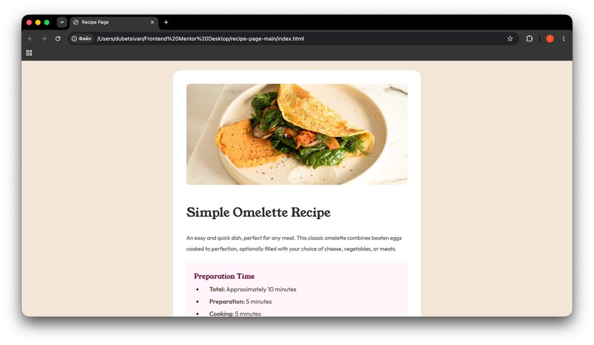
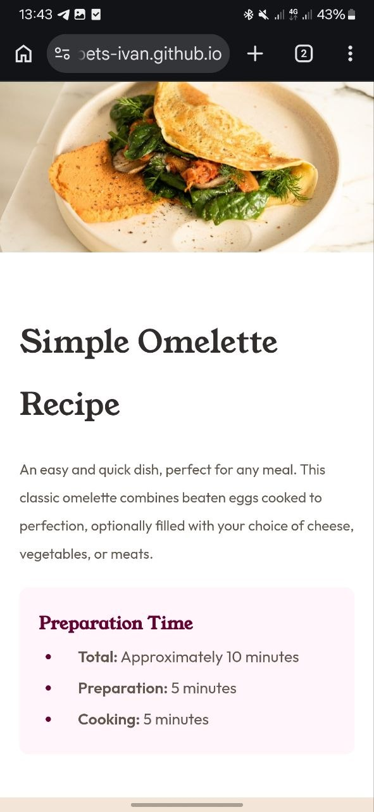

# Frontend Mentor - Recipe page

## Table of contents

- [Overview](#overview)
  - [The challenge](#the-challenge)
  - [Screenshot](#screenshot)
  - [Links](#links)
- [My process](#my-process)
  - [Built with](#built-with)
  - [What I learned](#what-i-learned)
  - [Continued development](#continued-development)
  - [AI Collaboration](#ai-collaboration)
- [Author](#author)

## Overview

## The challenge

Your challenge is to build out this recipe page and get it looking as close to the design as possible.

You can use any tools you like to help you complete the challenge. So if you've got something you'd like to practice, feel free to give it a go.

### Screenshot




### Links

- Solution URL: [https://github.com/Dubets-Ivan/recipe-page-main](https://github.com/Dubets-Ivan/recipe-page-main)
- Live Site URL: [https://dubets-ivan.github.io/recipe-page-main/](https://dubets-ivan.github.io/recipe-page-main/)

## My process

### Built with

- Semantic HTML5 markup
- Pure CSS
- CSS Flexbox
- Mobile-first workflow
- Responsive Web Design principles

### What I learned

During this project, I significantly improved my understanding of semantic HTML and responsive design. Here are a few things I'm really proud of:

**1. Semantic Tables & Accessibility:**
I learned how to properly structure tabular data without necessarily using `<thead>`. By using `<th>` for row headers, I made the nutrition table more accessible for screen readers while matching the visual design.

```html
<table>
    <tr>
        <th>Calories</th>
        <td class="bold brown">277kcal</td>
    </tr>
</table>
```

**2. Mobile Layout Strategy:** I figured out a clever way to make the hero image take up the full screen width on mobile devices while keeping the text properly padded. Instead of adding padding to the main container, I applied it directly to the sections.

```css
@media (max-width: 768px) {
    main {
        padding: 0;
        margin: 0;
        border-radius: 0;
        max-width: 100vw;
    }
    section {
        padding: 20px;
    }
    img {
        border-radius: 0;
    }
}

```

### Continued development

In future projects, I want to focus on:

- **CSS Grid:** I used Flexbox for centering and layout here, but I want to dive deeper into CSS Grid for more complex two-dimensional layouts.
- **Accessibility:** Continuing to improve my understanding of how screen readers interpret HTML, especially when using semantic tags.

### AI Collaboration

For this project, I used an AI coding assistant in a mentor role. Instead of writing code for me, the AI helped me by using the Socratic method—asking guiding questions and providing analogies (like comparing the CSS Box Model to a gift box with bubble wrap). This approach deeply reinforced my understanding of responsive padding and semantic HTML.

## Author

* GitHub - [Dubets-Ivan](https://github.com/Dubets-Ivan)
* Frontend Mentor - [@Dubets-Ivan](https://www.frontendmentor.io/profile/Dubets-Ivan)
